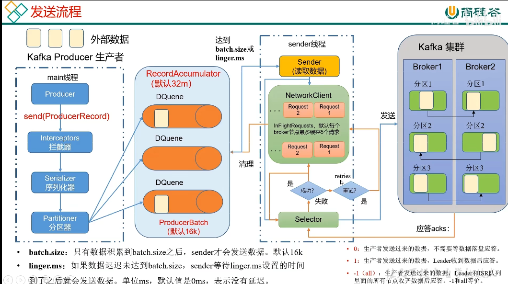
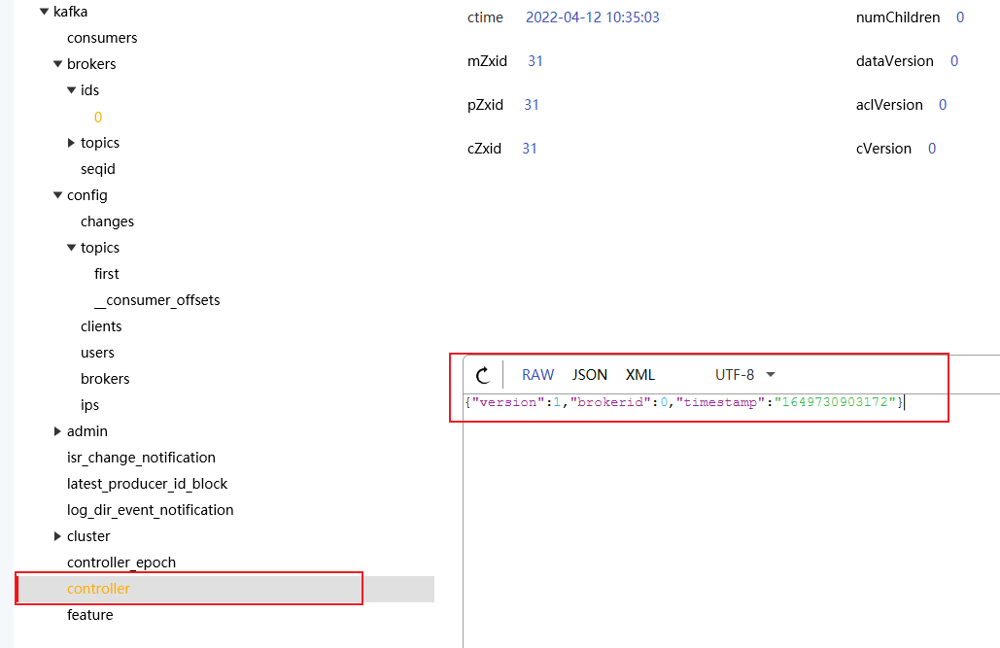
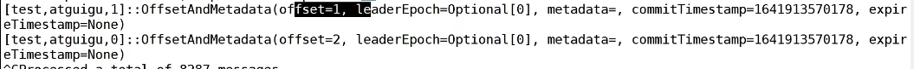

# kafka学习记录

## 消息队列的两种模式

### 1. 点对点模式

由生产者产生消息，发送到消息队列

由消费者主动拉取数据，消息收到后清除消息


### 2. 发布订阅模式

发布订阅模式，

- 可以有多个主题

- 也可以有多个消费者进行订阅同一个主题，消费数据互相独立，每个消费者都能消费数据
-  消息消费后，不会删除数据，新加入的消费者，可以读取所有的数据，默认不消费之前发送的数据


## kafka的配置文件

config 目录下的 server.propertis

```properties
#kafka 代理id 每个必须唯一
broker.id=0
# zookeeper 配置 最后一个是用来指定节点位置，代表这三个都在同一个节点
zookeeper.connect=ip:端口,ip:端口,ip:端口/kafka 

```


## kafka 命令行工具

- kafka-topics   topics管理工具

参数

```shell
# 指定连接到哪个节点
--bootstrap-server ip:端口，ip:端口
# 查询对应server的topics 列表
--list 
# 指定对应的 主题名称
--topic <topic name> 
#  创建主题
--create
# 指定创建主题的分区数目
--partitions <integer>
# 指定分区对应的副本数目
--replication-factor <integer>

# 创建主题的完整命令
kafka-topics --bootstrap-server ip:端口 --topic <topic name> --create --partitions <integer> --replication-factor <integer>
kafka-topics --bootstrap-server localhost:9092 --topic first --create --partitions 1 --replication-factor 1

# 查看服务器的主题完整命令
kafka-topics --bootstrap-server ip:端口  --list

# 查看 主题的具体信息
kafka-topics --bootstrap-server ip:端口 --topic <topic name> --describe

# 修改主题分区数目 数目只能增加 不能减少
kafka-topics --bootstrap-server ip:端口 --topic <topic name> --alter --partitions 3

# 副本数量 不能通过命令行的方式进行修改

# 创建主题
bin\windows\kafka-topics.bat --bootstrap-server localhost:9092 --topic second --create --partitions 2 --replication-factor 1
```


- kafka-console-producer 

```shell
# 生产者连接命令
kafka-console-producer  --bootstrap-server ip:端口 --topic <topic name>
```

- kafka-console-comsumer

```shell
# 消费者链接命令
kafka-console-comsumer  --bootstrap-server ip:端口 --topic <topic name>
# 参数 从以前的消息开始读取, 不加这个参数默认从现在开始读取消息，历史的消息不会进行读取
--from-beginning
```


## Kafka 发送消息的流程

生产者线程 -> 拦截器(用于对数据进行修饰处理，可以不需要拦截器)  -> 序列化器 (必须经过序列化器，这个序列化器是Kafka 重新进行实现的 Java 自带的序列化器 太重了, 有效数据和进行校验数据的占比不高,在大数据的场景下会丢失很多性能) ->分区器 (用于判断数据发送到那个分区)


RecordAccumulator 是一个发送缓冲队列，一个分区partition就会有一个队列 默认大小32M

RecordAccumulator 会由业务线程写入、Sender 线程读取，这是一个非常明显的生产者-消费者模式

[经典并发同步模式：生产者-消费者设计模式 - 知乎 (zhihu.com)](https://zhuanlan.zhihu.com/p/73442055)


ProducerBatch 是每个批次数据的大小，当达到这个大小的时候，sender(发送者线程) 就会发送数据默认16k

batch.size 当数据累积到 batch.size sender才会发送数据

linger.ms   假如迟迟没有达到 ProducerBatch 的大小，  sender等待到 linger.ms  后 sender 就会数据





## Kafka 默认分区器

默认分区器的规则：

- 指定了分区的序号，那么发送到指定的分区
- 未指定分区，有key的输入，那么传到 key的HashCode 与分区数的取余 的结果 分区
- 未指定分区，也没有key的输入，那么 随机传到一个分区中。 随机分区在 当前批次已经发送了的时候 进行改变。 发送的时机有 超过了linger.ms、当前分区已经满了


## 实现自定义分区器

1. 通过实现接口 Partitioner
2. 在生产者配置中 使用配置

```java
// 关联自定义分区器
properties.put(ProducerConfig.PARTITIONER_CLASS_CONFIG,"");
```


## 提高生产者的吞吐量


利用以下的参数进行 提高生产者的吞吐量

batch.size 批次的大小 默认为16K，当数据量很大的时候，可以加大批次的大小，一次性发送较多的数据，减少发送次数，增大吞吐量

linger.ms 通过设置 时长， 等待较多的数据的时候，才进行发送数据，可以减少发送次数，增大每次发送的数据量，但是不能设置过高，过高容易造成消息延迟

设置压缩方式， 将数据进行压缩， 使原本的批次大小 可以发送更多的数据，同时会消耗CPU性能进行压缩

通过设置缓冲区大小，让生产者可以持续不断的进行生产数据，而不是在阻塞的等待当中，在缓冲区未满的情况下，可以提高吞吐量


## Ack应答机制


ack=0的时候， 发送到kafka的leader，未落盘的时候，就继续发送下一个数据，丢失数据的概率很高

ack=1 当kafka集群的leader 数据落盘时，发送下个数据  有一定可能性会丢失数据

ack=-1 当kafka 的所有flower 都落盘的时候，发送下一个数据， 当存在2个副本或以上的时候， ISR的应答最小副本数量大于等于2的时候，不会丢失数据


ISR 即 跟leader 保持同步的follower + leader集合，当 30s内 follower 没有向leader 发送通信请求或者同步数据， 那么 将提出ISR队列，设置参数为 replica.lag.time.max.ms 默认为30s


修改ack 应答机制配置

```java
// 修改应答机制
properties.put(ProducerConfig.ACK_CONFIG,"1");
```

修改sender的重试次数

```java
// 修改应答机制
properties.put(ProducerConfig.RETRIES_CONFIG,3);
```


## Kafka 最少发送一次数据对应的应答级别

- 至少一次 ACK级别设置为-1，分区副本数量 大于等于2，ISR应答的最小副本数量大于等于2
- 最多一次 ACK级别设置为0
- 精确一次 在 至少一次的条件下 设置幂等性


设置参数为

```
# 开启幂等性 默认是开启幂等性的
enable.idempotence=true

```


## Kafka 事务


## Kafka 单分区有序实现方法


## kafka工作流程 简介的


## 副本的作用


## 每日总结笔记


## Kafka 注册到zookeeper 的过程

新启动一个Kafka server ，这个就是一个broker

那么会在broker.ids 下面新增一个Kafka的id，这个id是在server.properties中设置，并且必须为全局唯一

```properties
broker.id=0
```

controller 中，就会记录一个 辅助选举的 brokerid，谁先抢到，谁就是controller

controller的职责之一就是 监听  **broker.ids** 的变化，当leader挂掉的时候， broker.ids就会少了一个leader节点，然后 再从AR中寻找下一个可以用的副本，将他更新为leader，并且 要在Isr的列表中，


```json
{"version":1,"brokerid":0,"timestamp":"1649730903172"}
```





注意点，每个分区都有一个leader

ar 队列就是生成副本里面的序号，这个表示下一个领导的节点， 作为领导节点，必须要在isr 列表中


## follower 故障处理细节


LEO (Log End Offset) ：每个副本的最后一个offset， 也就是最新的offset+1

HW(High Watermark): 所有副本中最小的LEO


假如一个follower 挂掉，那么isr队列就会剔除他。

follower 重启后，会将上次挂掉的HW之后的数据全部删除掉，(HW之后的数据可能是没有经过验证的数据，所以全部删除) 重新向leader 同步数据，拉取数据，此时的follower 就叫做OSR， 同步比较慢的副本集合

当follower 读取的数据 对应的LEO， 大于等于HW的时候，那么就会重新加入到ISR队列中


## leader故障处理


当leader 发生故障的时候，controller 会监听 broker.ids 变化， 推选下一个 在isr中的 AR副本，以AR的排序选择下一个leader

当leader挂了，选举新的leader后， 以leader的leo作为最新的leo，也就是有其他副本的leo大于 leader的leo的内容 全部删除，以leader的副本为主

所以会存在数据丢失，当leader挂掉之后， 因此ack=1的时候，任然会产生数据丢失

他能保证副本数据的一致性，不能保证数据不丢失 不重复


## leader partition的再平衡

当分区的leader 发生过宕机，leader发生过选举后，broker又进行重启了，那么 对应的leader在所有的AR中，承担了多个leader的作用，因此会是不平衡的，有些原本是leader的broker，变成了副本，有些原本是副本的broker 升级为leader，所以需要再平衡

如何算不平衡比例

针对AR的优先副本，查看当前的分区的优先 副本， leader是否为排列在最前的副本，如果不是 那么不平衡个数+1

也就是本来分区2的默认leader为 broker0， 但是 broker 0 不是分区二的leader，所以不平衡节点+1，AR副本的总数是4，不平衡比例就是 1/4=0.25 >0.1

不平衡比例  默认比例是10，当操作这个比例 就会触发自动平衡

自动平衡的参数 auto.leader.rebalance.enable 默认是开启的

建议生产环境 不开启，或者将 自动平衡的比例数量调高，不然 每次平衡都会是很大的一笔消耗


## Kafka的文件存储

kafka 是按照topics进行存储的，一个topic分为多个分区，一个分区，有多个segment(分片)，每个segment的大小是1G， 1G的大小，进行读取文件和查询也是非常有压力的，因此还引入了稀疏索引进行加快读取速度。 稀疏索引就是不会每一条数据对应的偏移量都可以找到对应的position位置，而是存储一定的数据量插入一条索引数据，默认大小是4KB， 还有时间的索引，用来获取时间段对应的消息。

每个分片的数据是以 最低的偏移量命名的，比如第0个分片就是   000000000.log 000000000.index 000000000.timeindex

读取数据的时候，首先查找文件，比如 第一个分片是  000000350.log  000000350.index 000000350.timeindex

然后查找的数据在350之前，定位到第0个分片，然后读取对应的索引记录， 找到最接近当前偏移量的数据，但是不大于当前偏移量的那条索引，获取对应的position，然后往下查找，一般4KB的数据就会有一条索引，所以查找的数据量非常小，很快就能查找到对应的消息


kafka分区的分片log，是经过序列化处理的，因此无法使用文本的方式直接查看，需要用对应的kafka提供的工具进行查看日志文件，索引文件


配置稀疏索引的插入时机

```properties
# 默认4kB插入一条稀疏索引
log.index.interval.bytes=4KB
```


index文件里面存储的偏移量是 相对偏移量 实际偏移量是=相对偏移量+文件的偏移量  目的是为了用足够小的数据存储较大的数额，因为偏移量是不断累加的，数字越来越大，那么存储的长度也就越来越大


## kafka的文件清理策略

一： 删除

kafka默认是采取按照时间进行清理数据的，一般只保存7天的数据，第二中是基于日志文件的大小进行删除日志的


默认取timeindex的最大值进行判断当前segment是否过期，然后进行删除的


对于相同的key 只取最后一个进行写入，之前的数据，全部不需要了，比如 key1 = A 然后后面输入 key1=B，那么压缩后， key1=A的记录删除，只保留最后的一个value 也就是key1=B


## kafka 高吞吐量的原因


使用了0拷贝的技术，页缓存的技术


## Kafka的消费方式

Kafka的消费者 消费方式是通过让消费者不断的去**拉取数据**进行消费的，有缺陷就是需要不断的循环等待数据，没有数据的时候，会返回空数据

Kafka没有采用推的方式进行消费数据，因为每个消费者处理数据的速度都是不同的，主动推送数据可能导致消费者处理不完数据


## Kafka消费的总体流程


每个单独的消费者都是一个消费者组，每个消费者组都必须要有一个全局唯一的id，一个消费者可以消费所有分区的数据，消费者也可以指定分区进行消费。

消息只能被 同一个消费者组的1个消费者 消费，也就是 同1个消费者组 只能有一个消费者进行消费数据，消费完成后，同一个组的其他消费者就不能消费数据了。


如何判断是同一个消费者组， 同一个消费者id就是同一个消费者组的数据

_comsume_offset 是消费者消费的偏移量记录主题 主键是 <消费者id+partitionId 得到的值是offset，可以记录每个消费者消费的情况，这个是维护在kafka的系统主题里面的

在老版本的时候，这个offset 是维护在 zookeeper里面的，由于很多的消费者都需要和zookeeper进行大量的交互，把压力分担大zookeeper上面了，可靠性不能保证


## 消费者组的初始化流程

Kafka集群中每个主题都会有对应的leader， coordinator 是辅助实现消费者组的初始化和分区分配的东西

coordinator 选择方式 是 消费者groupid 的hashcode %50 (__comsumer_offset的分区数目)  获取到 comsumer主题的partition对应的broker

消费者初始化流程

1. 所有的消费者都向 coordinator  发送加入消费者组的请求
2. coordinator选举一个 消费者leader
3. coordinator 分发对应的主题 和分区信息给消费者leader
4. 消费者leader生成对应的消费方案(哪个消费者消费哪个分区)，并发送给coordinator
5. coordinator 下发消费方案给各个消费者
6. 消费者与coordinator 保持心跳 (默认3s)，当超过(session.timeout.ms=45000)45s的时候，就会剔除消费者，并出发再平衡，消费者处理消息时长(max.poll.interval.ms5分钟) 5分钟过长，也会出发再平衡


## 消费者组消费细节

消费者对消费的分区 发起一个 消费请求(sendFetches) 到 ConsumerNetworkClient(用于和kafka交互的中间层) 

当kafka  数据达到(Fetch.min.bytes 每批次最小抓取大小 默认1字节) 或者 (fetch.max.wait.ms 一批数据的最小值未达到的超时时间 默认500ms)就会返回数据到

conpletedFetches队列中，消费者从这个队列进行抓取数据

 kafka每批次最大的抓取大小为 fetch.max.bytes 默认50M

消费者每次最大抓取的记录数量为 max.poll.records=500条

消费者经过 **反序列化器**，**拦截器**后再处理数据，拦截器可以用来记录消费的数据数量，经过反序列化器是因为 kafka集群是不会对数据进行处理的，只进行数据的存储和发送，生产者发送过来的数据是序列化的，消费的时候，就要进行反序列化处理


## 消费者实操


消费者必须指定一个消费者组id，命令行工具不需要的原因是已经自动帮我们填入了一个随机的消费者组id

## 消费者消费示例

### 单个消费者订阅主题示例

```
```


### 消费者消费指定分区示例


```shell
# 创建主题 2个分区 1个副本
bin\windows\kafka-topics.bat --bootstrap-server localhost:9092 --topic second --create --partitions 2 --replication-factor 1
```


```java
// 生产者发送指定分区代码
Properties properties = new Properties();
properties.put(ProducerConfig.BOOTSTRAP_SERVERS_CONFIG, "localhost:9092");
properties.put(ProducerConfig.KEY_SERIALIZER_CLASS_CONFIG, StringSerializer.class.getName());
properties.put(ProducerConfig.VALUE_SERIALIZER_CLASS_CONFIG, StringSerializer.class.getName());
KafkaProducer<String, String> kafkaProducer = new KafkaProducer<String, String>(properties);
for (int i = 0; i < 10; i++) {
    kafkaProducer.send(new ProducerRecord<>("second", 1, "", "aaa" + i), new Callback() {
        @Override
        public void onCompletion(RecordMetadata recordMetadata, Exception e) {
            System.out.println(recordMetadata.partition());
        }
    });
}
kafkaProducer.close();
```


```java
// 消费者消费指定分区代码
    public static void main(String[] args) {
        Properties properties = new Properties();
        // kafka集群地址
        properties.put(ConsumerConfig.BOOTSTRAP_SERVERS_CONFIG, "localhost:9092");
        // key反序列化器
        properties.put(ConsumerConfig.KEY_DESERIALIZER_CLASS_CONFIG, StringDeserializer.class.getName());
        // value反序列化器
        properties.put(ConsumerConfig.VALUE_DESERIALIZER_CLASS_CONFIG, StringDeserializer.class.getName());
        // 消费者组id  //必填
        properties.put(ConsumerConfig.GROUP_ID_CONFIG, "test");

        // 创建消费者
        KafkaConsumer<String, String> consumer = new KafkaConsumer<String, String>(properties);
        // 订阅主题
        consumer.subscribe(List.of("first"));

        while (true) {
            ConsumerRecords<String, String> consumerRecords = consumer.poll(Duration.ofSeconds(10));
            for (ConsumerRecord<String, String> consumerRecord : consumerRecords) {
                System.out.println(consumerRecord);
            }
        }
    }
```


## 消费者分区分配策略

### range分区策略

消费者组每个消费者都有自己消费的分区，那么，消费者分区方案是怎么产生的呢

Range： 针对每个topoic采取的是，topic分区数量 / 消费者数量 = 每个消费者消费的分区数量， 有余数的，平均的按顺序进行分配

比如 8个分区，3个消费者 8/3 = 2 ... 2，也就是 每个消费者的分区数量最少是2个， 第一个消费者+1 第二个消费者+1。

消费的分区为 消费者0   0，1，2 消费者1 3，4，5 消费者2 6，7

也就是说，有余数的时候，排前面的消费者会比后面的消费者多1个分区消费。 **会导致数据倾斜**，因为1个主题 消费者多1个，没什么问题，但是消费者是支持订阅多个主题的，也就是在主题多个主题订阅的情况下，前面的消费者 消费压力远远大于后面的消费者。

range的策略，当第一个消费者挂了的时候，会把当前的消费者数据 完整的数据 分配给下一个消费者进行消费， 再进行剩下2个消费者的再平衡。也就是消费者0挂了后，消费者1全部接替掉消费者0的数据，消费完成后，消费者1和消费者2进行再平衡

参数设置

```java
properties.put(ConsumerConfig.PARTITION_ASSIGNMENT_STRATEGY_CONFIG, "org.apache.kafka.clients.consumer.RangeAssignor");
```


### RoundRobin 分区策略

RoundRobin 是将所有 **topic** 的所有的**分区** 按照 hashcode排序，comsumer也按照hashcode进行排序，然后按照**轮询**的方式进行分配partition

也就是 假如有7个分区，3个消费者，那么分区的规则应该是如下。轮询的意思是 依次分配给下一个消费者，0->0,1->1,2->2,3->0,4->2....

消费者0 的分区为 0 3 6

消费者1的分区为 1 4

消费者2的分区为 2 5


当有个消费者挂掉的时候，**将他的分区依次分配给剩下的消费者**，进行消费数据，触发再平衡的时候，才会按照真**实排序的顺序**进行重新分配分区

参数设置

```java
properties.put(ConsumerConfig.PARTITION_ASSIGNMENT_STRATEGY_CONFIG, "org.apache.kafka.clients.consumer.RoundRobinAssignor");
```


### sticky 黏性 分区策略


黏性分区就是让 消费者尽可能的平均分配分区， 比如分区有7个，消费者有3个， 那么消费者的分区个数为 7/3=2...1，也就是第一个消费者分区有3个，其余只有2个，跟range的区别就是， 消费者的分区序号不是排序下来的，而是随机的，也就是第一个消费者 可能是 0 3 5 (2,3,6)...


当1个消费者挂掉的时候，他的分区会 算出平均到每个消费者应该分配多少个， 也就是挂掉的消费者分区数量/剩余消费者数= 商...余数

然后随机的将这些分区分配到剩下的消费者中去消费数据

例如 0,3,6    1,4    2,5,   第1个消费者挂掉后 就会将分区分配给剩下2个消费者 结果可能为  1，4，0        2，5，3，6， 再平衡的时候，不会改变当前的消费者分区了，这就是**黏性的由来**

```java
properties.put(ConsumerConfig.PARTITION_ASSIGNMENT_STRATEGY_CONFIG, "org.apache.kafka.clients.consumer.StickyAssignor");
```


## 消费者offset 维护位置


### 读取系统主题 comsumer_offsets


修改配置 config/consumer.properties

```properties
# 设置排除系统主题为false 修改完成后可以不用重启
exclude.internal.topics=false
```

消费者offset 维护的位置

在0.9版本之前 维护在zookeeper，0.9版本后，维护在 系统主题__comsumer_offsets, 存储的key为 groupId+topic+分区号，value 就是offset



```shell
bin/kafka-console-consumer.sh  --topic __consumer_offsets --bootstrap-server localhost:9092 --formatter "kafka.coordinator.group.GroupMetadataManager\$OffsetsMessageFormatter" --consumer.config config\consumer.properties --from-beginning

# windows下的处理
bin\windows\kafka-console-consumer.bat --topic __consumer_offsets --bootstrap-server localhost:9092 --formatter "kafka.coordinator.group.GroupMetadataManager$OffsetsMessageFormatter" --consumer.config config\consumer.properties
```

## 自动提交offset


```java
// 是否启动自动提交offset
properties.put(ConsumerConfig.ENABLE_AUTO_COMMIT_CONFIG, true);
// 设置自动提交间隔为1s
properties.put(ConsumerConfig.AUTO_COMMIT_INTERVAL_MS_CONFIG, 1000);
```


## 手动提交offset


代码设置为手动提交示例

```
// 是设置自动提交为false
properties.put(ConsumerConfig.ENABLE_AUTO_COMMIT_CONFIG, false);

// 异步提交
consumer.commitAsync();
// 同步提交
consumer.commitSync();
```


## 指定offset消费


## 常见问题归纳

### topics的数量如何设置

### broker 和分区的关系，副本的关系

> 生产者相关的问题

### 数据丢失 如何产生，如何避免

### 数据重复场景是如何产生的 如何避免

### Kafka 高吞吐量的原因

[kafka高吞吐量的原因 - 简书 (jianshu.com)](https://www.jianshu.com/p/6287868c8462)

